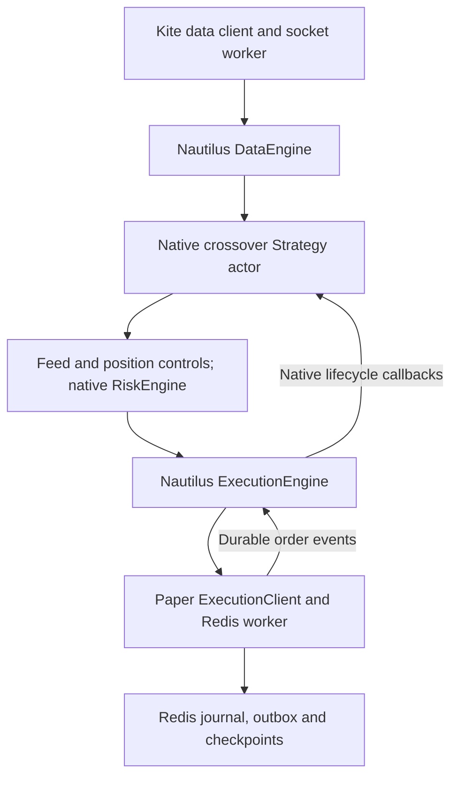

# Step 8: live Kite feed, native strategy and paper risk flow

## Verify the deterministic flow first

```bash
cd /home/ubuntu/RustNautilasProject
cargo run --locked -p kite-node -- paper-flow-sim config/strategy-crossover.toml
```

Expected with the supplied configuration: data_mode full, strategy_input KiteFullTick,
15 full_ticks (and 15 derived quotes), 2 signals, 2 paper fills,
0 denied orders, 0 open contracts, reconnect_generation 2,
native_strategy_actor true, native_risk_engine true, native_replay_verified true,
restart_resubmission_blocked true. Redis AOF barriers can make a run take about
a minute. This scenario injects a feed gap after the round trip; automated tests
also inject a gap while an order is pending.

## Verify live full ticks with simulated execution

```bash
cargo run --locked -p kite-node -- paper-live config/crudeoil-september.toml config/strategy-crossover.toml --seconds 30
```

The command resolves the current Kite instrument master and loads credentials
from Redis using the existing credential module:
susanta:kite_api_key and susanta:kite_access_token. No credentials are printed.

The first JSON contains the session namespace. The final JSON should contain
market_data_source kite_live, native_strategy_actor true, native_risk_engine true,
data_mode full, strategy_input KiteFullTick, full_ticks greater than zero,
broker_orders_accessed false, and live_orders_enabled
false. Signal and fill counts depend on the market; zero signals is a valid result.

The duration is bounded to 1..300 seconds. It requires an authenticated Kite
session and fresh MCX quotes. Startup, AOF persistence and teardown add time.
The read-only Kite REST and WebSocket services are accessed; Kite order mutation
endpoints are never called. Only PaperExecutionClient is registered for execution.

## Inspect persistence after restart

Use the namespace printed by the run:

```bash
cargo run --locked -p kite-node -- paper-recover YOUR_NAMESPACE
```

This reconstructs native orders/positions from the Redis outbox, checks quantities
against the journal, and compares finished session position state. It registers no
execution client and submits no orders. Expect resubmissions 0 and
automatic_resume_enabled false.

An interrupted session, unresolved order or nonzero position produces
requires_review true. A journal/outbox inconsistency returns an error. Starting
a worker against an existing namespace is rejected. This is restart inspection,
not automatic trading resumption. A fresh CLI run is a separate paper experiment;
it does not silently continue positions from a previous namespace.

## Runtime and component boundaries



Application modules under apps/kite-node/src/paper_flow:

| Module | Responsibility |
| --- | --- |
| actor | Native StrategyCore, DataActor full custom-data callback, Strategy order callbacks |
| diagnostics | Packet counts, rejection reasons and source/queue/checkpoint latency |
| risk | Feed generation, freshness, one-contract exposure and notional checks |
| session | Native component registration, bounded command/event queues, lifecycle |
| live | Existing Kite data client, bounded runtime, signal and feed handling |
| simulation | Deterministic fixture and reconnect verification |
| recovery | Read-only native replay and journal consistency checks |
| tests | Failure and end-to-end verification |

kite-paper/control_store persists session control checkpoints. The existing
worker handles order journal, native outbox and strategy checkpoint writes.
All order/application-state persistence uses Redis. No SQLite is introduced.

Native order commands are deferred until the quote callback returns and the
strategy decision is checkpointed. Risk-approved commands enter a separate
execution queue. The paper account is explicitly bound before native risk checks.
Native order callbacks are queued and dispatched after engine processing to avoid
reentrant mutable strategy access.

The runner drives a Nautilus TestClock explicitly using fixture time in simulation
and observed wall time during live quote processing, and dispatches due handlers.
This is a bounded application runner, not Nautilus LiveNode. The native core waits
for paper worker acknowledgements at decision/fill/control boundaries; it is not
a throughput-optimized production event loop. Queue overflow and persistence
uncertainty stop progression. Delayed feed data is checked again before entries.

## Enforced controls

- Standard CRUDEOIL26SEPFUT.MCX only, LIMIT/DAY, one contract per order.
- At most one long contract and one pending paper order.
- Maximum order notional INR 2,000,000, using the 100-barrel multiplier.
- Strategy-configured spread, source age and maximum entry count.
- Current feed generation; stale, backward and obsolete-generation data rejected.
- Same-second exchange updates are permitted because Kite timestamps have second
  precision; receiving timestamps must advance.
- Entry decisions rechecked against wall time after checkpoint latency.
- A new order cannot fill from a quote buffered before its paper acceptance.
- Existing Redis submission budgets and native RiskEngine throttling remain active.

These are paper controls. The synthetic balance is fixed and contract margin/fee
fields remain unconfigured. This does not validate production margin, account
economics, daily-loss protection, slippage, liquidity queue priority or partial
fills. Native paper modification and automatic position flattening remain pending.

## Disconnect and shutdown behavior

A transport gap blocks entries, clears strategy warm-up and cancels a pending paper
order. Quotes from the old generation cannot trade. Reconnection requires a newer
generation and fresh warm-up.

Poor-quality or stale data also suspends entries and cancels pending orders.
Fresh data on the same still-connected transport can restart warm-up. The gaps
counter includes these quality suspensions, not only socket reconnects.
risk_blocked counts feed/entry rejections.

Ctrl-C and normal completion cancel pending paper orders. Filled positions are
reported and preserved; no artificial closing fill is invented at shutdown.
An error leaves the session unfinished for recovery review.

Warm-up samples are rebuilt on restart rather than automatically resumed. Strategy
decisions, fill transitions, connection changes and finish state are checkpointed.
Journal, outbox, strategy and session checkpoints are separate Redis transactions;
a crash between writes requires review. No automatic resend is permitted.

The added session key is susanta:nautilus:sim:session:{UUID}. Earlier journal,
order-budget, strategy and native-events keys remain. The worker also reserves this
key for the older native paper simulator; it stays null there because that command
does not implement Step 8 session controls.

## Verification evidence

Automated checks cover:

- Native actor -> RiskEngine -> ExecutionEngine round trip and Redis replay.
- Native risk denial persisted before strategy notification.
- Gap with a pending order: cancellation, old-generation blocking, fresh warm-up.
- Stale quote rejection without a fill, followed by fresh-data recovery.
- One-contract position and notional guards.
- Abrupt child-process exit with an accepted order, Redis AOF restart, zero resends.
- Rejection of quotes buffered before paper acceptance.

Run the workspace gates:

```bash
cargo test --locked --workspace
cargo clippy --locked --workspace --all-targets -- -D warnings
```

A bounded live-feed check on 15 September 2026 delivered 20 quotes to the native
actor, with 0 signals/fills, 9 blocked updates and 0 broker order calls. This proves
live data routing; deterministic tests prove fills and failure behavior.

## Full-mode payload and diagnostics

The WebSocket subscription uses Kite full mode. The adapter retains every field
from the 184-byte MCX packet: LTP, last quantity, average price, cumulative volume,
total buy/sell quantities, OHLC, last-trade and exchange timestamps, open interest
and its day high/low, plus five bid and five ask levels with quantity and order
count. See the [Kite packet specification](https://kite.trade/docs/connect/v3/websocket/#quote-packet-structure).
Raw price fields ending in _paise use integer paise.

The native DataEngine publishes KiteFullTick custom data to the Strategy actor's
on_data callback. A derived QuoteTick still updates the native cache and supports
paper matching; the actor processes each accepted full tick once. The crossover
calculation remains based on bid/ask prices. Full mode provides more input fields;
it does not change the crossover trading rule or relax risk limits. Short LTP or
quote packets are rejected as incomplete_full_packet in this flow.

The final result includes last_full_tick and diagnostics:
- received_packets and full_packets count incoming and complete packets.
- full_ticks counts full updates delivered to the actor.
- rejected groups update rejections by reason, including spread_exceeded,
  stale_at_receipt and stale_in_queue.
- socket_gaps counts actual transport gaps; quality_suspensions counts quality
  transitions and watchdog_timeouts counts freshness watchdog suspensions.
- max_source_age_ms, max_queue_lag_ms and max_checkpoint_ms expose latency.

The existing gaps counter also includes control suspensions and shutdown; use the
separate diagnostic counters for transport investigation. Repeated invalid ticks
while suspended increment rejection counts without repeating the suspension
checkpoint. Buffered updates preceding paper acceptance have a separate counter.

Session control checkpoints retain the latest complete market snapshot at control,
decision and finish boundaries in Redis. This is not a tick-by-tick archive.
The older capture/replay commands continue to store derived quotes in Parquet.
No exchange order-book deltas or individual TradeTicks are fabricated from full
snapshots.

Additional automated checks cover all ten depth entries and packet fields, native
custom-data serialization, full-tick actor delivery, and separate spread/source-age/
queue-age rejection reasons.

A subsequent 30-second full-mode live check on 15 September 2026 received 28
complete packets and delivered 11 KiteFullTicks to the actor. All 17 rejected
updates exceeded the configured spread limit. There were 0 socket gaps, 6 quality
suspensions, 0 signals/fills and 0 broker order calls. Maximum checkpoint latency
was 2005 ms and queue lag 2986 ms. These counters describe this new run, not
the earlier unclassified output. Workspace tests passed 131 cases; Clippy passed
with warnings denied.
